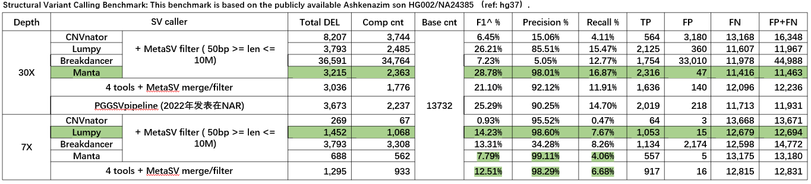

这里我们搭建了一个WGS_SV_MetaSV的流程，主要包含以下步骤：

1. 环境配置：需要安装在 **env** 目录的三个conda环境文件
2. 准备数据和配置文件：要分析的样本数据（这里我们的是cram格式的比对后文件），要准备分析的样本ID, 测序数据的深度，reads的长度，可以在 config.yaml 文件中配置；
如:样本信息配置
```yaml
samples:
    # sample or id to use for generating targets
    id_list: ["HG002_30X"]
    cram_path: "/BIGDATA2/gzfezx_shhli_2/USER/luozhenyu/20240124_EBV_Dengue/input_all"
```
3. 分析数据：这里我们使用breakdancer, lumpy, manta, cnvnator四个工具来检测样本中SV，最后使用metasv来整合过滤结果。相关的命令以及想进行参数调整的地方；可以在相关软件的 **.smk** 文件中进行调整。执行命令如下：
```shell
sh run_snakemake.sh
```

4. 结果评估：这里我们使用**HG002** 30X和7X的两个深度下的**Deletions SVs**与**HG002**的金标准结果来评估metasv的结果。
[**hg37的truth** 文件的下载地址](https://ftp-trace.ncbi.nlm.nih.gov/ReferenceSamples/giab/data/AshkenazimTrio/analysis/NIST_SVs_Integration_v0.6/)
```shell
# Compare to ground truth:
baseline=/WORK2/gzfezx_shhli_3/BioDatahub/GIAB/NIST_SVs_Integration_v0.6/HG002_SVs_Tier1_v0.6.vcf.gz
base_bed=/WORK2/gzfezx_shhli_3/BioDatahub/GIAB/NIST_SVs_Integration_v0.6/HG002_SVs_Tier1_v0.6.bed
truvari=/BIGDATA2/gzfezx_shhli_2/software/bin/truvari
$truvari bench -b $baseline -c HG002_30X_pass.DEL.mod.vcf.gz --includebed $base_bed  --pctseq 0 -o DEL.mod/
```
30x的评估结果路径：
```shell
PATH： /BIGDATA2/gzfezx_shhli_2/USER/luozhenyu/20240507_SV/HG002_30X/benchmark/*_DEL
```
7x的评估结果路径：
```shell
PATH： /BIGDATA2/gzfezx_shhli_2/USER/luozhenyu/20240507_SV/HG002_7X/benchmark/*_DEL
```

上面这表格是我们SV calling pipeline的benchmark的结果统计，
通过对30X和7X的分析：

30X的数据: 单独manta (calling) + metaSV (filtering)的结果在相关指标里会比较好，其次是4个工具合并后的方式

7X的数据: 单独Lumpy (calling) + metaSV (filtering)的结果在相关指标里会比较好，其次是4个工具合并后的方式

总体来说，manta的calling更精准，但数据量少时检测到的TPs会相对较少；
然后lumpy检测的假阳性会相对较高，但数量量少时检测到的TPs会相对较多；
综合四个工具，再整合结果、过滤的方式，结果会偏中间，不是很好但也不差。
